# File Structure Diagram

This diagram summarizes the current project layout.

## Tree

```text
V-Cuore/
├── .dockerignore
├── docker-compose.yml
├── Dockerfile
├── FILE_STRUCTURE.md
├── index.html
├── package-lock.json
├── package.json
├── pnpm-lock.yaml
├── postcss.config.js
├── README.md
├── tailwind.config.js
├── tsconfig.json
├── tsconfig.tsbuildinfo
├── vite.config.ts
├── public/
│   ├── favicon.ico
│   └── favicon.svg
├── src/
│   ├── App.tsx
│   ├── index.css
│   ├── main.tsx
│   ├── api/
│   │   └── index.ts
│   ├── components/
│   │   ├── common/
│   │   │   └── index.ts
│   │   ├── elements/
│   │   └── layout/
│   │       ├── HamburgerMenu.tsx
│   │       ├── Header.tsx
│   │       └── index.ts
│   ├── constants/
│   │   ├── Color.ts
│   │   └── index.ts
│   ├── hooks/
│   │   └── index.ts
│   ├── pages/
│   │   ├── index.ts
│   │   └── home/
│   │       ├── HomePage.tsx
│   │       ├── index.tsx
│   │       └── Rainbow.tsx
│   ├── store/
│   │   └── index.ts
│   ├── types/
│   │   └── index.ts
│   └── utils/
│       └── index.ts
├── dist/           (build output)
├── node_modules/   (dependencies)
└── .git/           (git metadata)
```

## Mermaid

```mermaid
graph TD
  A["V-Cuore"]

  A --> B["public"]
  A --> C["src"]
  A --> D["config files"]
  A --> E["dist"]
  A --> F["node_modules"]

  B --> B1["favicon.ico"]
  B --> B2["favicon.svg"]

  C --> C1["App.tsx"]
  C --> C2["main.tsx"]
  C --> C3["index.css"]
  C --> C4["api/index.ts"]
  C --> C5["components/"]
  C --> C6["constants/"]
  C --> C7["hooks/index.ts"]
  C --> C8["pages/"]
  C --> C9["store/index.ts"]
  C --> C10["types/index.ts"]
  C --> C11["utils/index.ts"]

  C5 --> C5A["common/index.ts"]
  C5 --> C5B["elements/"]
  C5 --> C5C["layout/"]
  C5C --> C5C1["HamburgerMenu.tsx"]
  C5C --> C5C2["Header.tsx"]
  C5C --> C5C3["index.ts"]

  C6 --> C6A["Color.ts"]
  C6 --> C6B["index.ts"]

  C8 --> C8A["index.ts"]
  C8 --> C8B["home/HomePage.tsx"]
  C8 --> C8C["home/index.tsx"]
  C8 --> C8D["home/Rainbow.tsx"]

  D --> D1["docker-compose.yml"]
  D --> D2["Dockerfile"]
  D --> D3["vite.config.ts"]
  D --> D4["tailwind.config.js"]
  D --> D5["postcss.config.js"]
  D --> D6["tsconfig.json"]
  D --> D7["package.json"]
  D --> D8["package-lock.json"]
  D --> D9["pnpm-lock.yaml"]
```


