# File Structure Diagram

This diagram summarizes the current project layout.

## Tree

```text
V-Cuore/
├── docker-compose.yml
├── Dockerfile
├── FILE_STRUCTURE.md
├── index.html
├── package.json
├── pnpm-lock.yaml
├── postcss.config.js
├── proxy.ts
├── README.md
├── tailwind.config.js
├── tsconfig.json
├── vite.config.ts
├── public/
├── src/
│   ├── App.tsx
│   ├── index.css
│   ├── main.tsx
│   ├── api/
│   │   └── index.ts
│   ├── assets/
│   ├── components/
│   │   ├── common/
│   │   │   └── index.ts
│   │   └── layout/
│   │       ├── HamburgerMenu.tsx
│   │       ├── Header.tsx
│   │       └── index.ts
│   ├── constants/
│   │   ├── index.ts
│   │   └── theme.ts
│   ├── hooks/
│   │   └── index.ts
│   ├── pages/
│   │   ├── HamburgerMenu.tsx
│   │   ├── Header.tsx
│   │   ├── index.ts
│   │   ├── home/
│   │   │   ├── HomePage.tsx
│   │   │   ├── Microphone.tsx
│   │   │   ├── NanashiInk.tsx
│   │   │   ├── NeoPorte.tsx
│   │   │   ├── Rainbow.tsx
│   │   │   ├── Target.tsx
│   │   │   └── index.tsx
│   │   ├── login/
│   │   │   ├── LoginGate.tsx
│   │   │   └── LoginPage.tsx
│   │   └── settings/
│   │       └── SettingPage.tsx
│   ├── store/
│   │   └── index.ts
│   ├── types/
│   │   └── index.ts
│   └── utils/
│       └── index.ts
└── dist/           (build output)
```

## Mermaid

```mermaid
graph TD
  A["V-Cuore"]

  A --> B["public/"]
  A --> C["src/"]
  A --> D["config files"]

  C --> C1["App.tsx"]
  C --> C2["main.tsx"]
  C --> C3["index.css"]
  C --> C4["api/"]
  C --> C5["assets/"]
  C --> C6["components/"]
  C --> C7["constants/"]
  C --> C8["hooks/"]
  C --> C9["pages/"]
  C --> C10["store/"]
  C --> C11["types/"]
  C --> C12["utils/"]

  C6 --> C6A["common/"]
  C6 --> C6B["layout/"]

  C7 --> C7A["index.ts"]
  C7 --> C7B["theme.ts"]

  C9 --> C9A["home/"]
  C9 --> C9B["login/"]
  C9 --> C9C["settings/"]
  C9 --> C9D["Header.tsx"]
  C9 --> C9E["HamburgerMenu.tsx"]
  C9 --> C9F["index.ts"]

  C9A --> C9A1["HomePage.tsx"]
  C9A --> C9A2["Microphone.tsx"]
  C9A --> C9A3["NanashiInk.tsx"]
  C9A --> C9A4["NeoPorte.tsx"]
  C9A --> C9A5["Rainbow.tsx"]
  C9A --> C9A6["Target.tsx"]
  C9A --> C9A7["index.tsx"]

  C9B --> C9B1["LoginGate.tsx"]
  C9B --> C9B2["LoginPage.tsx"]

  C9C --> C9C1["SettingPage.tsx"]

  D --> D1["docker-compose.yml"]
  D --> D2["Dockerfile"]
  D --> D3["vite.config.ts"]
  D --> D4["tailwind.config.js"]
  D --> D5["postcss.config.js"]
  D --> D6["tsconfig.json"]
  D --> D7["package.json"]
  D --> D8["pnpm-lock.yaml"]
  D --> D9["proxy.ts"]
  D --> D10["index.html"]
```


