# File Structure Diagram

This diagram summarizes the current project layout.

## Tree

```text
V-Cuore/
├── .dockerignore
├── .gitignore
├── docker-compose.yml
├── Dockerfile
├── FILE_STRUCTURE.md
├── index.html
├── proxy.ts
├── package-lock.json
├── package.json
├── pnpm-lock.yaml
├── postcss.config.js
├── README.md
├── tailwind.config.js
├── tsconfig.json
├── tsconfig.tsbuildinfo
├── vite.config.ts
├── public/
│   ├── favicon.ico
│   └── favicon.svg
├── src/
│   ├── App.tsx
│   ├── index.css
│   ├── main.tsx
│   ├── api/
│   │   └── index.ts
│   ├── assets/
│   │   ├── cloud.svg
│   │   └── ink-texture.png
│   ├── components/
│   │   ├── common/
│   │   │   └── index.ts
│   │   ├── elements/
│   │   └── layout/
│   │       ├── HamburgerMenu.tsx
│   │       ├── Header.tsx
│   │       └── index.ts
│   ├── constants/
│   │   ├── Color.ts
│   │   └── index.ts
│   ├── hooks/
│   │   └── index.ts
│   ├── pages/
│   │   ├── Header.tsx
│   │   ├── index.ts
│   │   ├── home/
│   │       ├── HomePage.tsx
│   │       ├── index.tsx
│   │       ├── Microphone.tsx
│   │       ├── NanashiInk.tsx
│   │       ├── NeoPorte.tsx
│   │       ├── Rainbow.tsx
│   │       └── Target.tsx
│   │   └── login/
│   │       ├── LoginGate.tsx
│   │       └── LoginPage.tsx
│   ├── store/
│   │   └── index.ts
│   ├── types/
│   │   └── index.ts
│   └── utils/
│       └── index.ts
├── dist/           (build output)
├── node_modules/   (dependencies)
└── .git/           (git metadata)
```

## Mermaid

```mermaid
graph TD
  A["V-Cuore"]

  A --> B["public"]
  A --> C["src"]
  A --> D["config files"]
  A --> E["dist"]
  A --> F["node_modules"]

  B --> B1["favicon.ico"]
  B --> B2["favicon.svg"]

  C --> C1["App.tsx"]
  C --> C2["main.tsx"]
  C --> C3["index.css"]
  C --> C4["api/index.ts"]
  C --> C5["assets/"]
  C --> C6["components/"]
  C --> C7["constants/"]
  C --> C8["hooks/index.ts"]
  C --> C9["pages/"]
  C --> C10["store/index.ts"]
  C --> C11["types/index.ts"]
  C --> C12["utils/index.ts"]

  C5 --> C5A["cloud.svg"]
  C5 --> C5B["ink-texture.png"]

  C6 --> C6A["common/index.ts"]
  C6 --> C6B["elements/"]
  C6 --> C6C["layout/"]
  C6C --> C6C1["HamburgerMenu.tsx"]
  C6C --> C6C2["Header.tsx"]
  C6C --> C6C3["index.ts"]

  C7 --> C7A["Color.ts"]
  C7 --> C7B["index.ts"]

  C9 --> C9A["index.ts"]
  C9 --> C9B["Header.tsx"]
  C9 --> C9C["home/HomePage.tsx"]
  C9 --> C9D["home/index.tsx"]
  C9 --> C9E["home/Microphone.tsx"]
  C9 --> C9F["home/NanashiInk.tsx"]
  C9 --> C9G["home/NeoPorte.tsx"]
  C9 --> C9H["home/Rainbow.tsx"]
  C9 --> C9I["home/Target.tsx"]
  C9 --> C9J["login/LoginGate.tsx"]
  C9 --> C9K["login/LoginPage.tsx"]

  D --> D1["docker-compose.yml"]
  D --> D2["Dockerfile"]
  D --> D3["vite.config.ts"]
  D --> D4["tailwind.config.js"]
  D --> D5["postcss.config.js"]
  D --> D6["tsconfig.json"]
  D --> D7["package.json"]
  D --> D8["package-lock.json"]
  D --> D9["pnpm-lock.yaml"]
  D --> D10["proxy.ts"]
```


